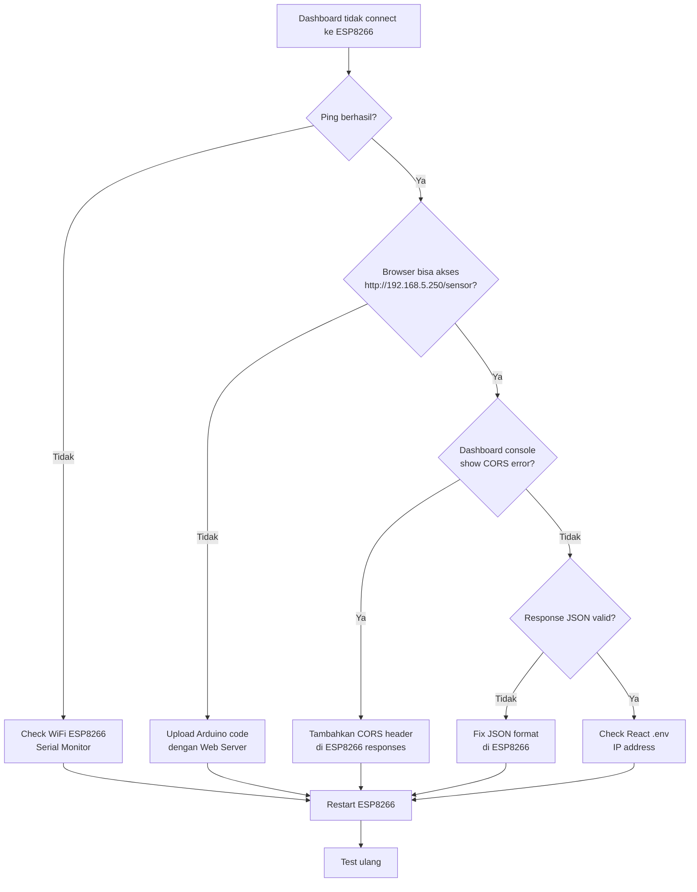

# 🔧 ESP8266 Troubleshooting Guide

## ❌ Problem: ESP8266 tidak terdeteksi di dashboard meskipun ping berhasil

### 📋 Checklist Diagnostik

#### 1️⃣ Verifikasi Koneksi Jaringan
```bash
# Test ping ESP8266
ping 192.168.5.250

# Expected: Reply dari 192.168.5.250
# Jika tidak reply, ESP8266 belum terkoneksi WiFi
```

#### 2️⃣ Test HTTP Endpoints Secara Manual

**Test dengan Browser:**
```
http://192.168.5.250/sensor
http://192.168.5.250/status
```

**Test dengan PowerShell:**
```powershell
# Test sensor endpoint
Invoke-WebRequest -Uri "http://192.168.5.250/sensor" -Method GET

# Test status endpoint
Invoke-WebRequest -Uri "http://192.168.5.250/status" -Method GET
```

**Expected Response:**
```json
// /sensor endpoint
{
  "temperature": 25.5,
  "humidity": 65.0,
  "light": 450,
  "distance": 15.5
}

// /status endpoint
{
  "servo": {
    "angle": 0,
    "locked": true
  },
  "led": {
    "red": true,
    "green": false
  },
  "buzzer": {
    "active": false
  },
  "lcd": {
    "line1": "Door LOCKED",
    "line2": "Waiting..."
  }
}
```

#### 3️⃣ Gunakan Test Mode di Dashboard

1. Buka dashboard di browser: `http://localhost:3000`
2. Klik tombol **"Test Mode"** di header
3. Dashboard akan menggunakan mock data
4. Ini berguna untuk testing UI tanpa hardware

#### 4️⃣ Gunakan Test ESP8266 Button

1. Klik tombol **"Test ESP8266"** di dashboard
2. Buka **Browser Console** (tekan F12)
3. Lihat hasil test koneksi detail:
   - ✅ Endpoint berhasil = HTTP server berjalan
   - ❌ Timeout = ESP8266 tidak merespon
   - ❌ Failed to fetch = CORS error atau server mati

### 🐛 Common Issues & Solutions

#### Issue 1: "Request timeout"
**Symptoms:**
- Dashboard shows "ESP8266: Disconnected"
- Console log: "ESP8266 timeout - Check if ESP8266 is running and responding"

**Causes:**
1. ESP8266 tidak menjalankan web server
2. Code Arduino belum diupload
3. ESP8266 restart/crash

**Solutions:**
```arduino
// Upload code ini ke ESP8266
#include <ESP8266WiFi.h>
#include <ESP8266WebServer.h>

const char* ssid = "YOUR_WIFI_SSID";
const char* password = "YOUR_WIFI_PASSWORD";

ESP8266WebServer server(80);

void handleSensor() {
  String json = "{";
  json += "\"temperature\":25.5,";
  json += "\"humidity\":65.0,";
  json += "\"light\":450,";
  json += "\"distance\":15.5";
  json += "}";
  
  server.sendHeader("Access-Control-Allow-Origin", "*");
  server.send(200, "application/json", json);
}

void handleStatus() {
  String json = "{";
  json += "\"servo\":{\"angle\":0,\"locked\":true},";
  json += "\"led\":{\"red\":true,\"green\":false},";
  json += "\"buzzer\":{\"active\":false},";
  json += "\"lcd\":{\"line1\":\"Door LOCKED\",\"line2\":\"Waiting...\"}";
  json += "}";
  
  server.sendHeader("Access-Control-Allow-Origin", "*");
  server.send(200, "application/json", json);
}

void setup() {
  Serial.begin(115200);
  
  WiFi.begin(ssid, password);
  while (WiFi.status() != WL_CONNECTED) {
    delay(500);
    Serial.print(".");
  }
  
  Serial.println("\nConnected!");
  Serial.print("IP: ");
  Serial.println(WiFi.localIP());
  
  server.on("/sensor", HTTP_GET, handleSensor);
  server.on("/status", HTTP_GET, handleStatus);
  server.enableCORS(true);
  server.begin();
}

void loop() {
  server.handleClient();
}
```

#### Issue 2: "Failed to fetch - CORS issue"
**Symptoms:**
- Console error: "CORS policy: No 'Access-Control-Allow-Origin' header"
- Network tab shows status 200 but no data

**Solution:**
Tambahkan CORS header di setiap response ESP8266:
```arduino
server.sendHeader("Access-Control-Allow-Origin", "*");
server.sendHeader("Access-Control-Allow-Methods", "GET, POST, OPTIONS");
server.sendHeader("Access-Control-Allow-Headers", "Content-Type");
```

#### Issue 3: "Connection refused"
**Symptoms:**
- Ping berhasil tapi HTTP gagal
- Browser tidak bisa akses http://192.168.5.250

**Causes:**
- Web server belum di-start di ESP8266
- Port 80 tidak listening

**Solution:**
Pastikan `server.begin()` dipanggil di `setup()`:
```arduino
void setup() {
  // ... WiFi setup ...
  server.begin();
  Serial.println("HTTP server started");
}

void loop() {
  server.handleClient(); // HARUS ada di loop!
}
```

#### Issue 4: IP Address Berubah
**Symptoms:**
- ESP8266 pernah connect, tapi sekarang tidak
- Ping timeout

**Solution:**
1. Check IP baru dari Serial Monitor ESP8266
2. Update di `.env`:
```env
REACT_APP_ESP8266_IP=192.168.5.XXX
```
3. Restart React dev server

Atau gunakan Static IP di ESP8266:
```arduino
IPAddress local_IP(192, 168, 5, 250);
IPAddress gateway(192, 168, 5, 1);
IPAddress subnet(255, 255, 255, 0);

WiFi.config(local_IP, gateway, subnet);
WiFi.begin(ssid, password);
```

### 📊 Debug Workflow



### 🧪 Testing Sequence

**Step 1: Network Test**
```bash
ping 192.168.5.250
# Expected: Reply dengan time<10ms
```

**Step 2: HTTP Test**
```powershell
curl http://192.168.5.250/sensor
# Expected: JSON response dengan sensor data
```

**Step 3: Dashboard Test**
1. Open browser console (F12)
2. Klik "Test ESP8266" button
3. Check console output untuk errors

**Step 4: Test Mode**
1. Toggle "Test Mode" button ON
2. Dashboard harus show mock data
3. Verify semua komponen render correctly

### 📝 ESP8266 Serial Monitor Output

**Expected output saat boot:**
```
Connecting to WiFi...
.....
Connected!
IP: 192.168.5.250
HTTP server started
```

**Expected output saat menerima request:**
```
[HTTP] GET /sensor
[HTTP] Sending response: 200 OK
[HTTP] GET /status
[HTTP] Sending response: 200 OK
```

### 🔍 Browser DevTools Checklist

**Console Tab:**
- ✅ "Attempting to connect to ESP8266..."
- ✅ "ESP8266 Sensor Response: {temperature: 25.5, ...}"
- ✅ "ESP8266 connected successfully!"
- ❌ "ESP8266 timeout" → Check Arduino code
- ❌ "CORS error" → Add CORS headers

**Network Tab:**
- Request to `http://192.168.5.250/sensor`
  - Status: **200 OK**
  - Type: **json**
  - Response headers include: `Access-Control-Allow-Origin: *`

### 💡 Pro Tips

1. **Always check Serial Monitor first**
   - Pastikan ESP8266 connect ke WiFi
   - Verify IP address yang didapat

2. **Use Test Mode untuk development**
   - Tidak perlu hardware untuk test UI
   - Mock data sudah realistic

3. **Test endpoints di browser dulu**
   - Sebelum test di dashboard
   - Lebih mudah debug

4. **Check firewall Windows**
   ```powershell
   # Allow port 3000 untuk React
   netsh advfirewall firewall add rule name="React Dev" dir=in action=allow protocol=TCP localport=3000
   
   # Allow port 5000 untuk Flask
   netsh advfirewall firewall add rule name="Flask API" dir=in action=allow protocol=TCP localport=5000
   ```

### 📞 Support

Jika masih error setelah semua langkah:
1. Screenshot Serial Monitor ESP8266
2. Screenshot Browser Console (F12)
3. Screenshot Network Tab untuk request ke ESP8266
4. Paste Arduino code yang diupload

## ✅ Success Indicators

Dashboard berfungsi dengan baik jika:
- ✅ Status indicator "ESP8266: Connected" (hijau)
- ✅ Sensor data terupdate setiap 2 detik
- ✅ Console tidak ada error
- ✅ Network tab show successful requests
- ✅ Test ESP8266 button show all ✅
